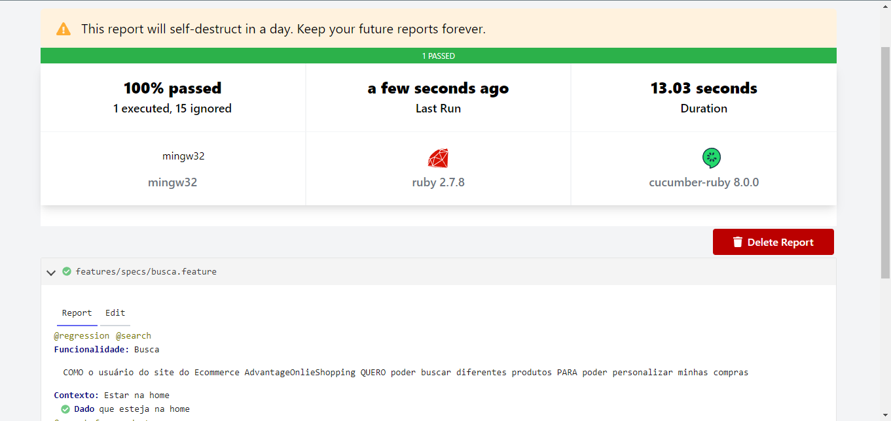

# Sprint 5




> Essa sprint foi dedicada a melhorar a qualidade do nosso projeto de testes, com foco na automação de testes. Durante esse período, exploramos várias etapas do processo de teste, incluindo a criação de mapas mentais, o desenvolvimento de cenários Gherkin e a implementação de testes automatizados usando Ruby, Cucumber, Capybara e SitePrism.


## 💻 Pré-requisitos

Antes de começar é importante saber que esse peojeto foi desenvolvido no sistema operacinial Windows e para outros sistemas os comandos podem mudar. Verifique se você atendeu aos seguintes requisitos:

* Instalar o  `<Ruby>`
* Intalar a versão mais recente do `<Cmder>`.
* Possuir `<VsCode com plugins --> Cucumber -- Cucumber(Gherkin) -- Gherkin Indent -- Ruby -- Snippets and Syntax Hihglight -- VSCode Ruby >`.

## 🚀 Instalando <Automação_Testes>

Para instalar o <Automação_Testes>, siga estas etapas:
    * `<Realizar Fork do repositório>`
    * `<No Cmder, entrar na pasta Automação_Testes>`


Windows:
```
<bundle install>
```

## ☕ Usando oprejeto <Automação_Testes>

Para usar <Automação_Testes>, siga estas etapas:

```
<bundle exec cucumber -p default -t@search_for_product --publish>
```


## 🤝 Autor

Iura Kurtz Filho

